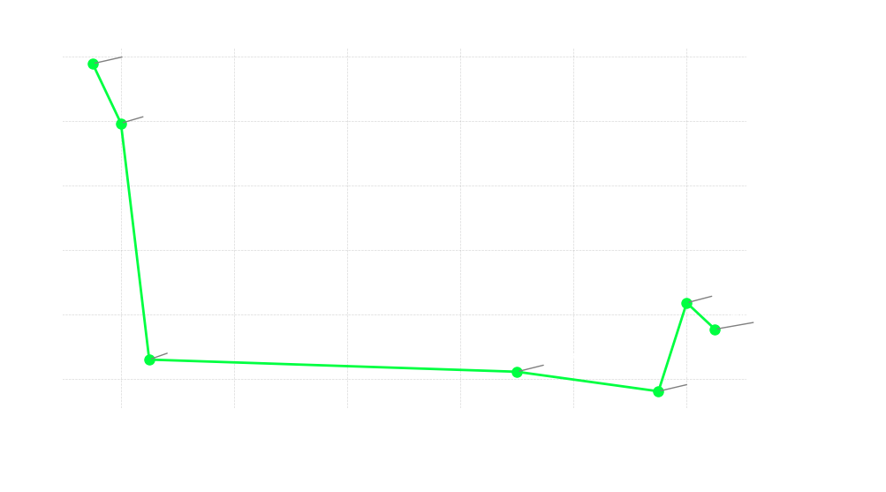

# HPC Wordle Solver
A concurrent C++ project to solve [Wordle](https://www.nytimes.com/games/wordle/index.html) with pure Dynamic Programming

## Status - OPTIMIZING
Has not been run on the full [Wordle answer set](#answer-and-guess-set) yet. Working up to it after many optimizations to not take up too much time on the school cluster

<p align="center">
  
</p>

## Algorithm
The algorithm itself is a Top-Down Minimax search with memoization. I initially called the repo "pure" Wordle because I have a [different project](https://github.com/Bozrem/mcdp-wordle) exploring an alternative algorithm.

The results show the expected total guesses in a game in which you start with a specific opener. For example, `Solved heart to 2.42` indicates that with perfect play, you can beat the game in an average of 1.42 more guesses (since 'heart' counts as 1).

From a more Reinforcement Learning perspective, the state is just a list representing all the answers that are still possible given the colors seen in the game, thus making it a Markov state.

When taking a guess, to calculate the transition between states, prune\_state (in Wordle.cpp) looks at what colors a guess would make for all the remaining possible answers, and eliminates them if the colors don't match what the 'true' answer would expect

The only real deviation from a "pure" DP is that at a depth of 6 it returns immediately with a high fail cost to dissuade failing and eliminate the branch.


## Optimizations
### Bitset
Status - COMPLETE

Speedup - N/A (implemented V1)

Instead of constantly passing around a vector of strings as the state, do a simple std::bitset

### FastBitset
Status - TODO

std::bitset is pretty fast, but by hiding the data it makes it impossible (or at least not recommended) to do SIMD operations.

FastBitset would be a custom class that simply replicates the used methods of std::bitset while making the core data public

### Action Pruning
Status - PARTIAL

Speedup - 1.19x (See partial)

As you go through a game of Wordle, some actions become useless. On the algorithm side, we can optimize this by eliminating useless (Never produces any reduction in the answer bitset) or duplicate (always produces the same subsequent states as another guess) guesses.

This is partial because the implementation needs to be revisited and further tested, but the core code is there.

### Wordle Lookup Table
Status - COMPLETE

Speedup - 3.8x

Instead of replaying Wordle transitions all the time while running the algorithm, or even caching them as we go, it's much quicker just to produce a Lookup Table matrix. This just takes a little bit of time at the start of the run, but it further enables the [SIMD optimization](#prune\_state-simd)

### Randomized Work Distribution
Status - TODO

The current main loop parallelizes over starting guesses (see [Concurrency](#system-design)) alphabetically, which seems more likely to cause redundant work. Could reduce the 10% redundancy rate for way more cache hits by selecting words that are very different, so it's less likely that two threads want the same state at the same time

### Prune\_state SIMD
Status - TODO

Prune\_state compares LUT results to a single set of colors, and is thus a really good candidate for vectorization. The most recent profile showed upwards of 30% of the compute time is in that, so this could be a significant speedup.

### Builtin Usage
Status - TODO

There are some spots in the Solver that it must go through the whole bitmap. Currently, it uses branching to skip bad ones. Could be much faster with some sort of `find_next_set_bit` instruction.

## System Design

### Memoization Strategy
The project initially had it's own concurrent hashmap, but it had performance issues, so the current one uses a public library.

Having a fail point at 6 guesses presents an interesting problem. The same state at a depth of 2 might have a different value as one at depth 6, since the 6 would likely be influenced by the fail cost. 

The approach in this project is to manage two maps.

#### Tainted (SpecificMap)
If a state value was influenced by the fail cost, then it ONLY has that value at that exact depth. This map has both Depth and State as the key, and is the fallback if the AgnosticMap fails

#### Untainted (AgnosticMap)
If a state value has no fail cost influence, it CAN be used in some other depths. It's value is saved alongside it's maximum depth. It is able to be used in other depths when `depth + max_depth < 7`, meaning that it still wouldn't use a fail cost if computed in this depth.

### Concurrency Strategy
After fiddling a lot with a task-based concurrency system for better checkpointing, I decided to go with the simplicity of only parallelizing across the root node. `main.cpp` sets up the OpenMP threads, and assigns each one to a starter guess. From there, threads operate independently (with the exception of Memoization). This also makes it much easier to define critical sections to print, checkpoint, etc.

I am interested in exploring an OpenMPI solution that uses multiple nodes, but that would be a lot of overhead in syncing MemoizationTables.

## Project Structure & Build
### Structure
```
.
├── CMakeLists.txt
├── data
│   ├── answers.txt
│   ├── answers_small.txt       // Set of 50 answers for testing and benchmarking
│   └── guesses.txt
├── include
│   ├── Definitions.hpp         // Config struct and constexprs
│   ├── MemoizationTable.hpp    // Caching
│   ├── Solver.hpp              // DP Algorithm
│   ├── Statistics.hpp          // Statistic Tracking
│   └── Wordle.hpp              // Wordle LUT and state transitions
├── run_solver.slurm
├── src
│   ├── MemoizationTable.cpp
│   ├── Solver.cpp
│   ├── Wordle.cpp
│   └── main.cpp
└── tests
    ├── CMakeLists.txt
    ├── MemoizationTableTest.cpp
    ├── WordleTests.cpp
    └── test_patterns.csv       // Some example Wordle results to test against
```

### Dependencies
These are all installed via CMake
- [Greg Popovitch's Parallel Hashmap](https://github.com/greg7mdp/parallel-hashmap) for state caching
- OpenMP for parallelization

### Building Locally
> [!NOTE]
> The current build relies on an x86\_64 architecture. Extension to other machines is on the TODO list.

```sh
mkdir build

# Install dependencies
cmake -S . -B build

# Compile
cmake --build build
```

#### Lotus Cluster
If you have access to the Rhodes College LOTUS Cluster:
```sh
module load gcc
module load cmake

# Submit Job
sbatch run_solver.slurm

# Check status or get job ID
squeue -u <your_username>

# View live output (doesn't include stderr)
tail -f wordle_<job_id>.out

# Cancel
scancel <job_id>
```

Alternatively, you can start an interactive shell and just run it there.
```sh
# Expires after an hour
salloc --nodes=1 --exclusive --time=01:00:00

./build/WordleSolver
```

## Future Plans
Most of my work is in cleanup and implementing more [optimizations](#optimizations). Outside of that, here are a few things I want to explore in the future
- Results browser to actually use the computed results live in gameplay
- Checkpointing and result exporting
- Explore CUDA application
- Better CLI interaction
- Much better testing

## Notes
### Answer and Guess set
Before being bought, you could view much of the Wordle source code from the website, including the allowed set of guesses and the set of possible answers. 

After buying Wordle, NYTimes closed off these files, so I technically the numbers are not accurate to the NYT version
